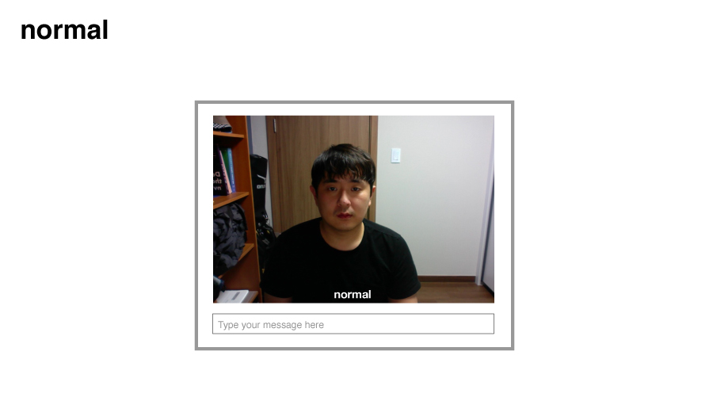
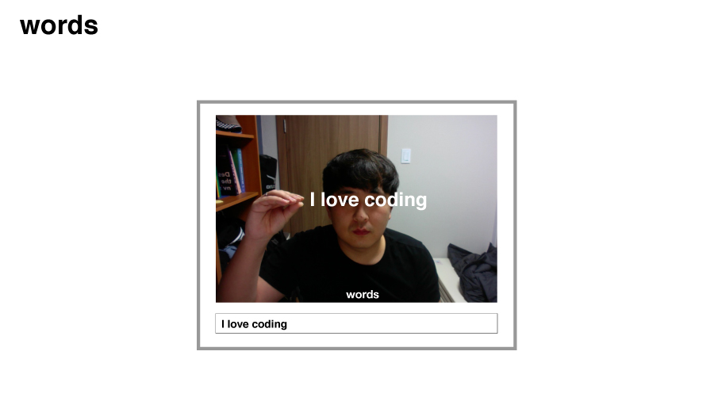
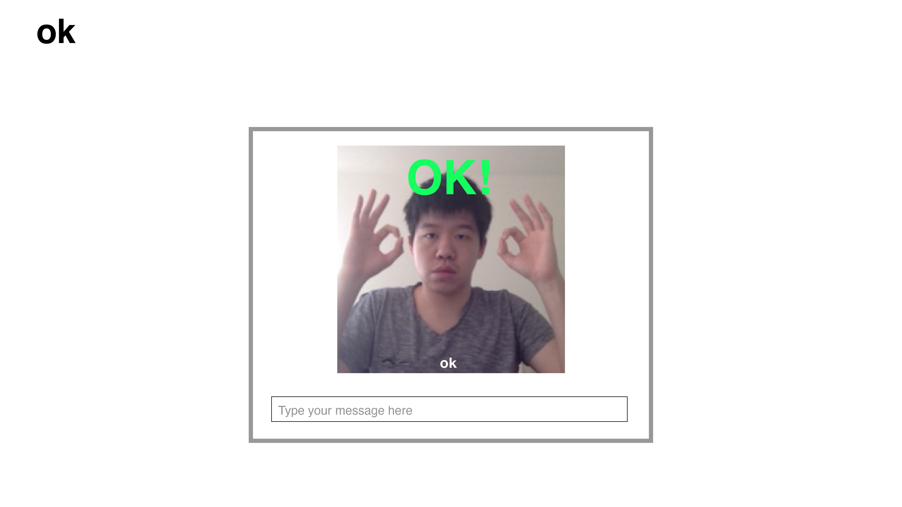
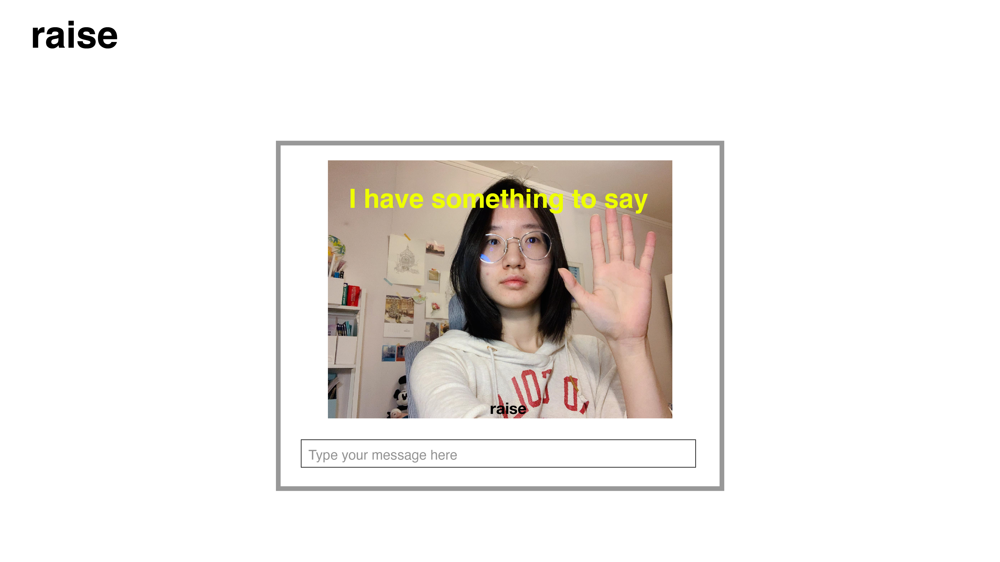
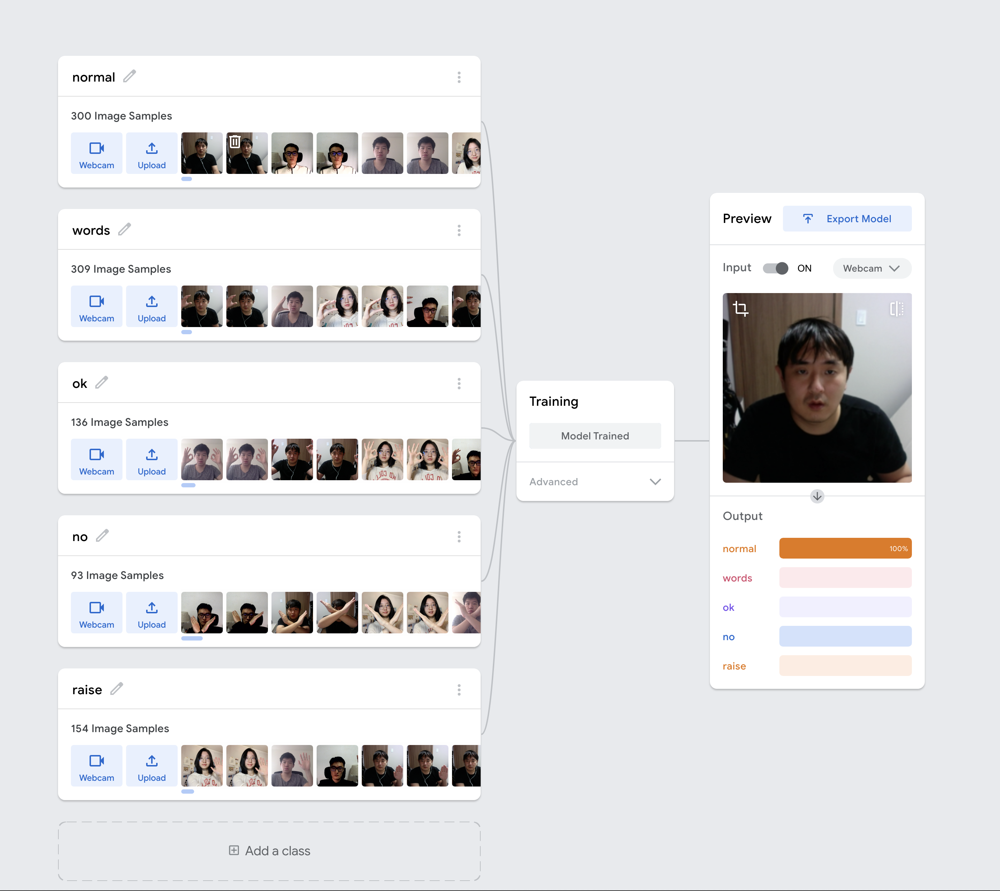
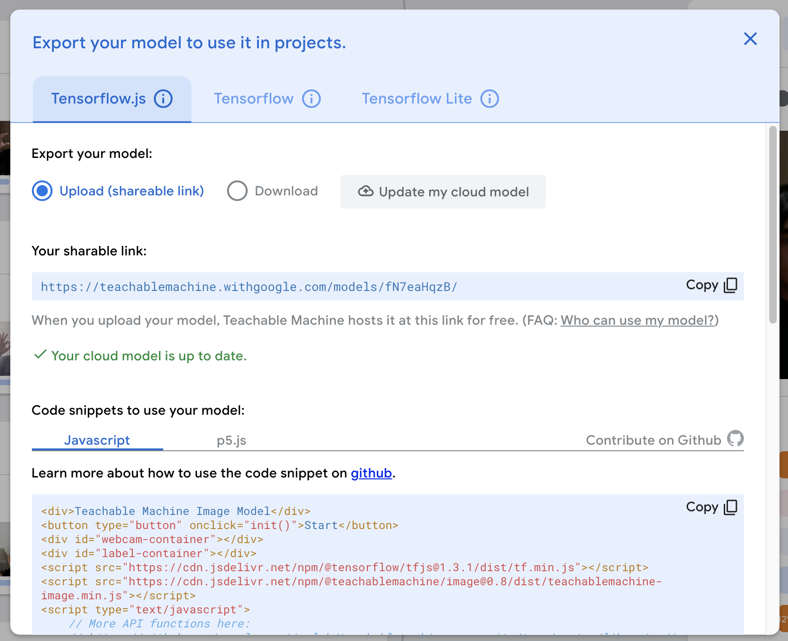
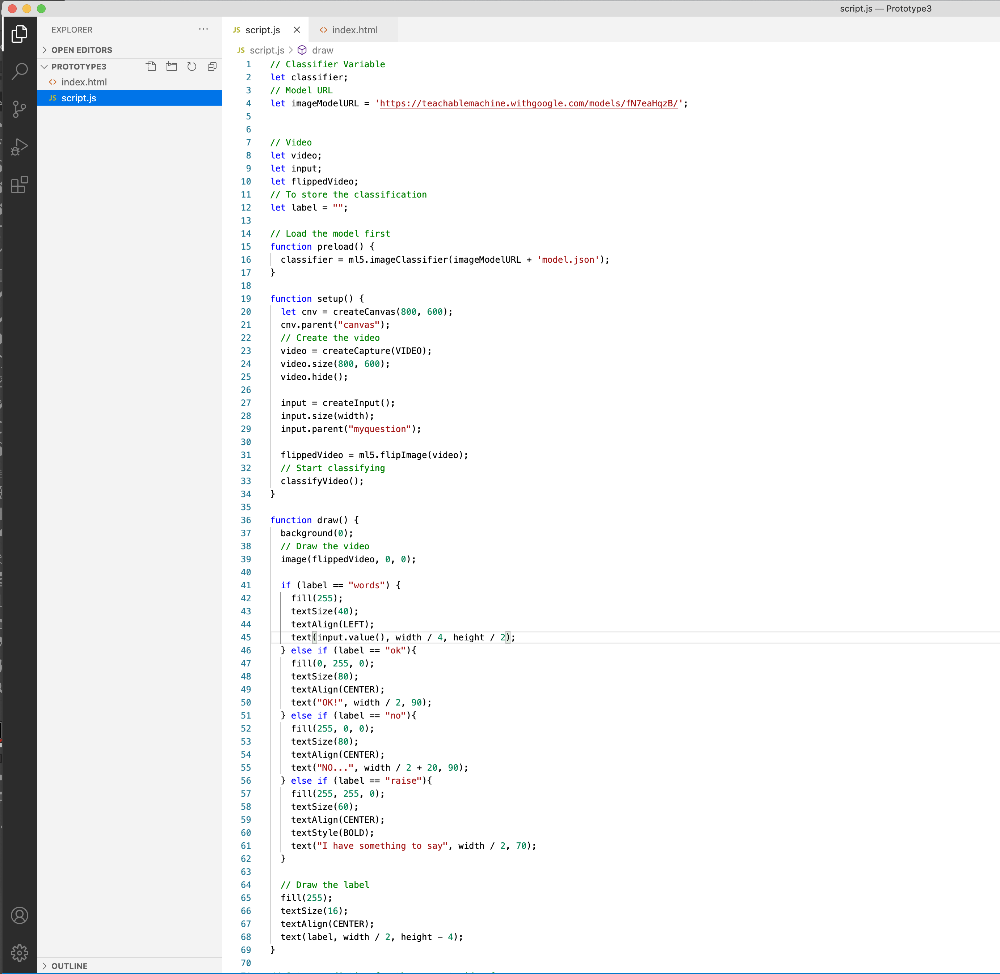

## Roles

Data collection — Junbae Choi, Tianyi Fu, Tien-Wei Ho, Yuxuan Hou

Gesture Ideas — Junbae Choi, Tianyi Fu, Tien-Wei Ho, Yuxuan Hou

Creating code using Teachable Machine — Junbae Choi

Coding for Visual Effect 1 — Junbae Choi

Coding for Visual Effect 2 — Tianyi Fu

Coding for Visual Effect 3 — Tien-Wei Ho

Coding for Visual Effect 4 — Yuxuan Hou

##
## Sketch for the first prototype

##
## Process

